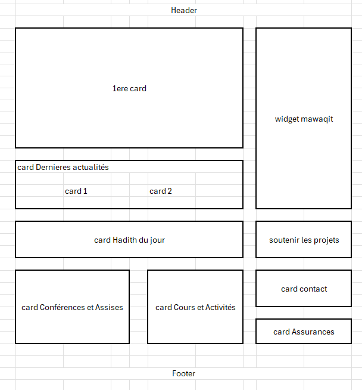

# 🕌 Mosquée Bilal - Fichier de Suivi du Projet

**Date de début :** 11 avril 2026
**Statut :** En cours
**Architecture :** Next.js 16 + React 19 + Tailwind CSS 3 + TypeScript

---

## 📋 Vue d'ensemble du Projet

### Vision
Créer une plateforme numérique moderne, apaisante et fonctionnelle pour la Mosquée Bilal. Le site sert de pont entre l'association et la communauté, tout en facilitant la gestion interne.

### Objectifs
- **Informer :** Horaires de prière, actualités, événements
- **Éduquer :** Documentation sur l'Islam
- **Gérer :** Interface d'administration robuste (CMS maison)
- **Sécuriser :** Architecture compatible Supabase (Auth + RLS)

### Architecture du Site (Sitemap)

#### Front-office (Public)
| Page | Description |
|------|-------------|
| Accueil | Hero section, Widget Mawaqit, Dernières actus, CTA Dons/Activités |
| Actualités / Événements | Liste filtrable des news et agenda |
| Activités communautaires | Cours, sorties, services sociaux |
| Documentation sur l'Islam | Articles pédagogiques, FAQ |
| Infos pratiques | Accès, horaires, services (obsèques, assurances) |
| Contact | Formulaire et plan |

#### Back-office (Admin)
| Page | Description |
|------|-------------|
| Connexion | Interface sécurisée (Supabase Auth) |
| Dashboard | Statistiques rapides, notifications de messages |
| Gestion de contenu | Liste/Édition des articles, événements, pages |
| Médiathèque | Gestion des images et documents |
| Paramètres | Rôles (Admin, Éditeur, Lecteur), Profil |

---

## 🎨 Design System

### Light Mode - "The Living Sanctuary" (Sakinah UI)
| Token | Couleur | Hex |
|-------|---------|-----|
| Primary | Émeraude profond | `#064E3B` |
| On Primary | Blanc | `#FFFFFF` |
| Primary Container | Émeraude foncé | `#064E3B` |
| Primary Fixed | Menthe clair | `#B0F0D6` |
| Primary Fixed Dim | Menthe dim | `#95D3BA` |
| Secondary | Neutre chaud | `#5E5E5C` |
| Secondary Container | Sable clair | `#E1DFDC` |
| Tertiary | Or mat | `#B45309` |
| Tertiary Container | Brun | `#733100` |
| Tertiary Fixed | Pêche | `#FFDBCA` |
| Tertiary Fixed Dim | Abricot | `#FFB68E` |
| Background | Blanc bleuté | `#F9F9FF` |
| Surface | Blanc bleuté | `#F9F9FF` |
| Surface Container Lowest | Blanc pur | `#FFFFFF` |
| Surface Container Low | Bleu très clair | `#F0F3FF` |
| Surface Container | Bleu clair | `#E7EEFF` |
| Surface Container High | Bleu dim | `#DEE8FF` |
| Surface Container Highest | Bleu dim+ | `#D8E3FB` |
| On Surface | Gris ardoise | `#111C2D` |
| On Surface Variant | Vert gris | `#404944` |
| Outline | Gris vert | `#707974` |
| Outline Variant | Gris bleuté | `#BFC9C3` |

### Dark Mode - "The Celestial Sanctuary" (Saphir & Ambre)
| Token | Couleur | Hex |
|-------|---------|-----|
| Primary | Bleu argent | `#BEC6E0` |
| Primary Container | Midnight | `#0F172A` |
| Tertiary (Ambre) | Ambre doré | `#FFB95F` |
| Background | Midnight profond | `#0B1326` |
| Surface | Midnight | `#0F172A` |
| Surface Container Low | Bleu nuit | `#131B2E` |
| Surface Container High | Ardoise foncé | `#222A3D` |
| Surface Container Highest | Ardoise | `#2D3449` |
| Surface Bright | Ardoise clair | `#31394D` |
| Surface Variant | Ardoise transparent | `rgba(30,41,59,0.5)` |
| On Surface | Blanc cassis | `#F8FAFC` |
| On Surface Variant | Ardoise moyen | `#94A3B8` |
| Outline | Ardoise foncé | `#475569` |
| Outline Variant | Gris foncé | `#45464D` |

### Typographie
- **Titres (Spiritual/Editorial) :** Noto Serif
- **Corps (Fonctionnel) :** Inter (light mode) / Manrope (dark mode)

### Principes de Design
- **"No-Line Rule" :** Pas de bordures 1px solid pour sectionner. Utiliser les changements de couleur de surface.
- **Glassmorphism :** Surface à 60-80% opacité + backdrop-blur 12-20px
- **Élévation tonale :** Hiérarchie par les surfaces empilées, pas par les ombres
- **Ghost Border :** Outline variant à 15-20% opacité si bordure nécessaire
- **Grille asymétrique :** Marges asymétriques, éléments qui débordent

---

## � Spécifications Techniques

| Élément | Technologie |
|---------|-------------|
| Framework | Next.js 16 (App Router) |
| UI Library | React 19 |
| Styling | Tailwind CSS 4 |
| Langage | TypeScript |
| Backend (futur) | Supabase (PostgreSQL + Auth + RLS) |
| Intégrations | Iframe Mawaqit (horaires de prière) |
| Accessibilité | Contrastes élevés, navigation clavier, mobile-first |

---

## 🔍 Journal des Actions Détaillé

### PHASE 1 : Initialisation du Projet

#### ✅ Sous-étape 1.1 : Nettoyage et configuration de base
**Date :** 11 avril 2026
**Statut :** ✅ Terminée

**Actions menées :**
1. ✅ Suppression de tous les fichiers du projet précédent (`src/`, `.next/`, `middleware.ts.disabled`)
2. ✅ Arrêt des processus Node.js en cours
3. ✅ Installation de `@tailwindcss/postcss` (dépendance requise pour Tailwind CSS v4)
4. ✅ Mise à jour de `postcss.config.js` : remplacement de `tailwindcss` par `@tailwindcss/postcss`
5. ✅ Mise à jour de `src/app/globals.css` : remplacement de `@tailwind` par `@import "tailwindcss"` (syntaxe v4)

#### ✅ Sous-étape 1.3 : Créer les composants UI de base (Header, Footer, ThemeToggle)
**Date :** 11 avril 2026
**Statut :** ✅ Terminée

**Actions menées :**
1. ✅ Création de `ThemeToggle.tsx` — Bouton toggle clair/sombre avec icônes soleil/lune
2. ✅ Création de `Header.tsx` — Navigation responsive avec logo, liens, recherche, bouton connexion, menu mobile
3. ✅ Création de `Footer.tsx` — Navigation, infos, liens légaux, copyright
4. ✅ Intégration du Header et Footer dans `layout.tsx`
5. ✅ Copie du logo dans `/public/logo.png`
6. ✅ Correction du bug Tailwind v4 → downgrade vers Tailwind CSS v3.4 (compatible chemin avec `#`)
7. ✅ Configuration `tailwind.config.js` avec tous les tokens de couleur CSS custom
8. ✅ Serveur fonctionnel — HTTP 200 sur http://localhost:3000

#### ✅ Sous-étape 1.7 : Page Admin - Connexion + Dashboard
**Date :** 11 avril 2026
**Statut :** ✅ Terminée

**Actions menées :**
1. ✅ Création de `AuthContext.tsx` — Contexte d'authentification simulée
2. ✅ Intégration de `AuthProvider` dans `layout.tsx`
3. ✅ Création de `/admin` — Page de connexion avec formulaire (email + mot de passe)
4. ✅ Mode démo : n'importe quel email/mot de passe fonctionne
5. ✅ Création de `/admin/dashboard` — Dashboard complet avec :
   - Stats : 148 articles, 7 événements, 2 481 abonnés
   - Tableau de contenu récent avec statuts (Publié/Brouillon)
   - Rappels admin avec checkboxes
6. ✅ Layout admin avec navigation : Dashboard, Hadiths, Actualités, Événements, Médiathèque, Paramètres
7. ✅ Profil utilisateur + bouton déconnexion
8. ✅ Sous-pages : `/hadiths`, `/news`, `/events`, `/media`, `/settings` (placeholders)
9. ✅ Toutes les pages admin répondent en HTTP 200

#### ✅ Corrections UI et contenu (session 2)
**Date :** 11 avril 2026
**Statut :** ✅ Terminée

**Actions menées :**
1. ✅ Logo agrandi à 64px (header) puis 128px (admin login)
2. ✅ Menu non opaque (`bg-background` au lieu de `glass-nav`)
3. ✅ Slogan "Foi, fraternité, proximité" masqué sous lg (`lg:block hidden`)
4. ✅ Logo taille fixe avec `flex-shrink-0`
5. ✅ Champs recherche supprimé du header (desktop + mobile)
6. ✅ Logo négatif en dark mode via classe CSS `.logo-invert`
7. ✅ Page Infos pratiques : transport avec lignes bus colorées (TCL), parking
8. ✅ Page Infos pratiques : 3 cards alignées (Horaires, Accès, Plan d'accès)
9. ✅ Google Maps intégré dans card Plan d'accès, lien externe supprimé
10. ✅ Icône localisation MawaqitWidget → lien vers /infos
11. ✅ Hadith n°8 retiré (pas Bukhari/Muslim), type `Hadith` créé
12. ✅ Page admin Hadiths (`/admin/dashboard/hadiths`) avec CRUD
13. ✅ Commit et push vers GitHub

**Prochaines étapes :**
- [ ] Phase 2 : Connexion Supabase réelle + Base de données
- [ ] Phase 3 : CRUD Actualités/Événements avec Supabase
- [ ] Phase 4 : Médiathèque upload + Rôles utilisateurs

#### ✅ Sous-étape 1.6 : Créer les pages de navigation
**Date :** 11 avril 2026
**Statut :** ✅ Terminée

**Actions menées :**
1. ✅ Création de `/actualites` — Grille de 6 cartes d'actualités placeholder
2. ✅ Création de `/activites` — 4 activités : Tajwid, Arabe, Sorties, Aide Sociale
3. ✅ Création de `/documentation` — 6 catégories : 5 Piliers, Coran, Sira, Hadith, Prière, FAQ
4. ✅ Création de `/infos` — Horaires d'ouverture, Accès, Services (Obsèques, Conseil, Salle)
5. ✅ Création de `/contact` — Formulaire + coordonnées + placeholder carte
6. ✅ Toutes les pages répondent en HTTP 200

#### ✅ Sous-étape 1.5 : Page d'accueil - Widget Mawaqit + Section Actualités
**Date :** 11 avril 2026
**Statut :** ✅ Terminée

**Actions menées :**
1. ✅ Création de `MawaqitWidget.tsx` — Iframe responsive des horaires de prière (mawaqit.net)
2. ✅ Création de `NewsSection.tsx` — 3 cartes d'actualités avec images, badges catégorie, dates, titres
3. ✅ Création de `QuickLinks.tsx` — Liens rapides Cours & Activités, Contact
4. ✅ Intégration dans `page.tsx` : Hero → Mawaqit → QuickLinks → Actualités

#### ✅ Sous-étape 1.4 : Page d'accueil - Hero Section
**Date :** 11 avril 2026
**Statut :** ✅ Terminée

**Actions menées :**
1. ✅ Création de `HeroSection.tsx` — Bento grid avec image hero + carte prochaine prière
2. ✅ Titre : "Mosquée Bilal" / Sous-titre : "Neuville-sur-Saône"
3. ✅ Countdown dynamique vers la prochaine prière (mise à jour toutes les minutes)
4. ✅ Quick Stats : Annonces, Conférence, Communauté, CTA Don
5. ✅ Design fidèle au template Stitch (arrondi 2.5rem, glassmorphism, gradients)
6. ✅ Mise à jour de `page.tsx` pour intégrer le Hero

---

### ✅ Session 5 — Page Documentation + refonte Actualités
**Date :** 13 avril 2026
**Statut :** ✅ Terminée

#### Page Actualités — Refonte des cards grille
**Actions menées :**
1. ✅ 2 articles "à la une" en ligne (chacun 1/2 largeur), style `card-green`, layout 3 colonnes (photo 1/3 + texte 2/3)
2. ✅ Hauteurs réduites d'1/3 sur toutes les cards (h-[120px] featured, h-[96px] grille)
3. ✅ Cards grille : remplacement `<button>` par `<div>` + `cursor-pointer` (résolution du gap image)
4. ✅ Image via `background-image` CSS inline (résolution définitive du gap entre card et image)
5. ✅ `ArticleModal.tsx` : ajout champ `imagePosition?: string` et `featured?: boolean` sur interface `Article`

#### Page Documentation Islam — Création complète
**Actions menées :**
1. ✅ 7 cards thématiques : Fondements de l'Islam, Le Coran, La Sira, Les Hadiths, La Prière, Le Jeûne, FAQ
2. ✅ Chaque card : image banner h-24 + icône + titre + liste de sujets cliquables
3. ✅ 4 à 6 sujets par card avec contenus détaillés en français
4. ✅ Modale par sujet — **non fermable depuis l'extérieur** (uniquement via bouton ✕)
5. ✅ Rendu du texte enrichi : `**gras**` parsé en `<strong>`
6. ✅ Style identique aux cards Actualités (`bg-surface-container-lowest shadow-sm rounded-2xl`)
7. ✅ Grille responsive : 1 → 2 → 4 colonnes
8. ✅ En-tête page identique aux autres pages (icône + h1 serif uppercase + sous-titre)
9. ✅ Titre : "Documentation sur l'Islam"

#### Correction globale — Bordure visible sur les cards avec image
**Actions menées :**
1. ✅ Ajout classe CSS `.card-border` dans `globals.css` : pseudo-élément `::after` superposé (`position: absolute; inset: 0; border: 1px solid var(--color-card-border); pointer-events: none; z-index: 10`)
2. ✅ Classe appliquée sur les cards grille Actualités et les cards Documentation
3. ✅ Bordure visible en light mode (émeraude) et dark mode (ambre), même par-dessus les images

**Commit :** `ddfcca7` — pushé sur GitHub

---

### ✅ Session 6 — Réécriture complète page Documentation Islam
**Date :** 14 avril 2026
**Statut :** ✅ Terminée

#### Réécriture des textes — Ton ludique, empathique et pédagogique
**Actions menées :**
1. ✅ Réécriture complète des 45 topics sur 8 cards avec un ton accessible et détaillé
2. ✅ Card 1 : Les fondements de l'Islam (6 topics) — Shahada, Salat, Zakat, Siyam, Hajj, Piliers de la foi
3. ✅ Card 2 : Le Coran (5 topics) — Qu'est-ce que le Coran, Révélation, Tajwid, Structure, Thèmes
4. ✅ Card 3 : La Sira (5 topics) — Naissance, Révélation, Hégire, Médine, L'adieu du Prophète
5. ✅ Card 4 : Les Hadiths (4 topics) — Qu'est-ce qu'un hadith, Grands recueils, 40 hadiths Nawawi, Hadith de Djibril
6. ✅ Card 5 : La Prière (4 topics) — Conditions, Ablutions, Étapes, Joumou'a
7. ✅ Card 6 : Le Jeûne (4 topics) — Piliers/conditions, Ramadan, Laylat al-Qadr, Jeûnes hors Ramadan
8. ✅ Card 7 : Quelques Prophètes (12 topics détaillés) — Adam, Nouh, Ibrahim, Ismaïl, Ishaq, Yacoub, Youssouf, Moussa, Dawud, Sulayman, Younus, 'Issa
9. ✅ Card 8 : FAQ (5 topics) — Conversion, Halal, Apprendre à prier, Islam en Occident, Apprendre l'arabe

#### Modifications complémentaires
**Actions menées :**
1. ✅ Titre page changé : "C'est quoi l'Islam ?" avec icône MessageSquareHeart
2. ✅ Sous-titre Card 4 : "Paroles, actes et approbations du Prophète ﷺ"
3. ✅ Nouvelles images : Card La Sira (calligraphie Muhammad), Card La Prière, Card Le Jeûne (lanterne), Card FAQ (bokeh doré)
4. ✅ Remplacement de tous les "—" par "-" dans les titres et contenus
5. ✅ Ajout Chaf' & Witr dans les rak'at de la prière de l'Isha
6. ✅ Zakat al-Fitr déplacée dans le topic Ramadan
7. ✅ Ablutions : étapes séparées par des sauts de ligne pour meilleure lisibilité
8. ✅ Formulaire contact (page Infos) : header en card-green style AideSocialeModal

**Commit :** `40346d9` — pushé sur GitHub

---

### ✅ PHASE 2 : Front-office - MAQUETTE FINALISÉE
**Date :** 15-16 avril 2026 (Sessions 7-8)
**Statut :** ✅ Terminée

Toutes les pages front-office sont créées avec un design cohérent light/dark :

| Page | Route | Statut |
|------|-------|--------|
| Accueil | `/` | ✅ Finalisé |
| Actualités | `/actualites` | ✅ Finalisé |
| Activités | `/activites` | ✅ Finalisé |
| Documentation Islam | `/documentation` | ✅ Finalisé |
| Infos pratiques | `/infos` | ✅ Finalisé |
| Dons | `/don` | ✅ Finalisé |
| Certificat | `/certificat` | ✅ Finalisé |
| Admin Login | `/admin` | ✅ Finalisé |

#### Session 7 - 15 avril 2026
1. ✅ Menu "Don" renommé en "Dons"
2. ✅ 3e card actualité (Zakat al-Fitr) sur la page d'accueil
3. ✅ Dernière ligne accueil restructurée : Cours+Islam | Certificat | Contact+Assurances
4. ✅ Chevrons uniformes w-6/h-6 avec hover primary sur toutes les cards
5. ✅ Page `/certificat` créée (4 sections + CTA)
6. ✅ Hover Aide Sociale : bouton #F59E0B (light) / #0F172A (dark) via CSS
7. ✅ Page Infos restructurée : Horaires+Contact col 1, Accès+Map fusionnés col 2-3
8. ✅ "Lire l'article" ancré en bas des cards Actualités

#### Session 8 - 16 avril 2026
1. ✅ Page `/don` créée : Pourquoi donner + Plateformes + Projets + CTA card-green
2. ✅ Composants FloatField centralisés : FloatInput, FloatTextarea, FloatSelect
3. ✅ Transforms de saisie : capitalize, uppercase, lowercase, phone
4. ✅ Formulaire Contact (page Infos) : FloatInput + validation + bouton grisé
5. ✅ Formulaire Aide Sociale : migré vers FloatInput/FloatSelect/FloatTextarea
6. ✅ Page Admin Login : suppression mode démo, ajout accès visiteur (modal)
7. ✅ Mot de passe : icône Eye/EyeOff pour visibilité
8. ✅ Card Services en 2 colonnes avec hover
9. ✅ Photo mosquée dans card Accès (position absolute)
10. ✅ Suppression page `/contact` (doublon avec `/infos`)
11. ✅ Card "Soutenir" (accueil) pointe vers `/don`

**Commits :** `8e6236c` (Session 7) - pushé sur GitHub

### PHASE 3 : Back-office / Admin (À venir)
- [ ] Sous-étape 3.1 : CRUD Actualités
- [ ] Sous-étape 3.2 : CRUD Événements
- [ ] Sous-étape 3.3 : Médiathèque
- [ ] Sous-étape 3.4 : Paramètres / Rôles
- [ ] Sous-étape 3.5 : Persistance des données (Supabase)

### PHASE 4 : Backend Supabase (Futur)
- [ ] Configuration Supabase
- [ ] Authentification réelle
- [ ] Base de données + RLS
- [ ] API Routes Next.js
- [ ] Formulaires connectés (Contact, Aide Sociale, Accès visiteur)

---

## � Notes et Décisions

- **Thème par défaut :** Light mode (Sakinah UI). Le choix de l'utilisateur est sauvegardé pour ses prochaines visites.
- **Palette Light Mode :** Dossier `sakinah_ui_light_mode/DESIGN.md`
- **Palette Dark Mode :** Dossier `saphir_ambre_dark_mode/DESIGN.md`
- **Template de référence :** Dossier `stitch_mosquee_bilal_neuville/`
- **Logo :** `images/logos/New-Bilal-Logo.png`

---

## 🚀 Commandes utiles

```bash
npm run dev      # Lancer le serveur de développement
npm run build    # Construire pour la production
npm run start    # Lancer en production
```

**URL locale :** http://localhost:3000
